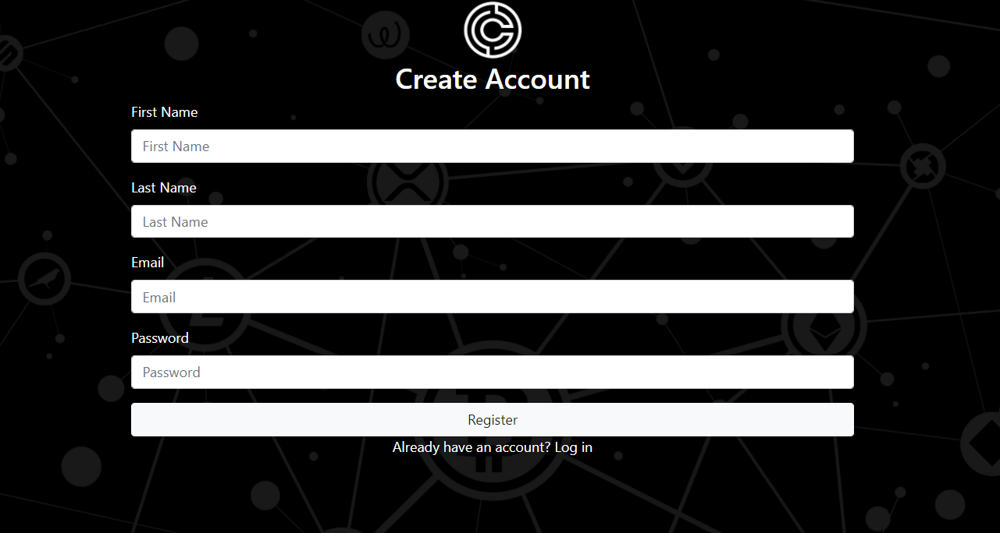
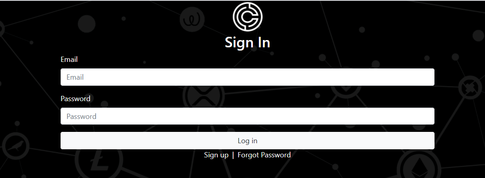
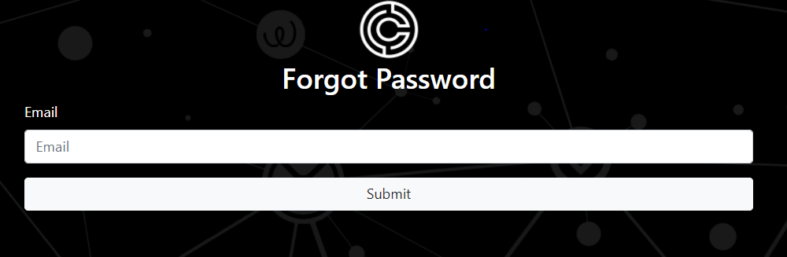
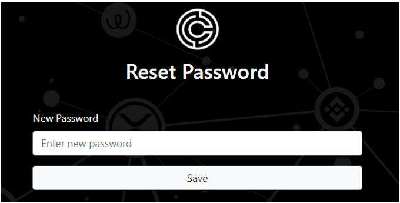
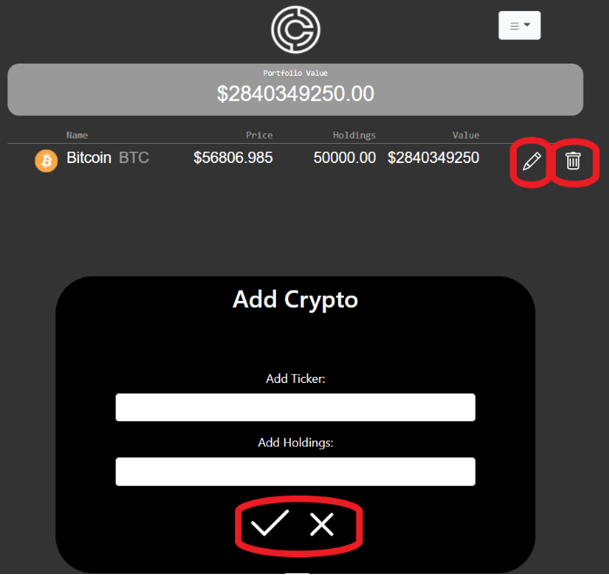
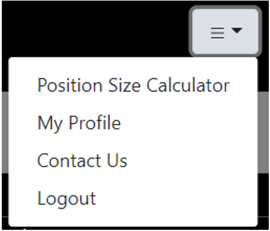
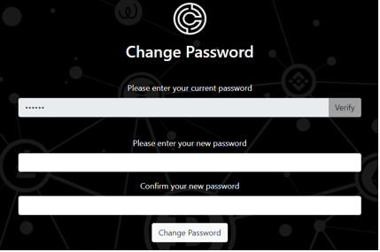

# Welcome to Cryptolio!

Cryptolio is a Cryptocurrency portfolio tracker and position size calculator. We were founded in January of 2021, so are currently in beta stage. We hope to support many more cryptocurrencies on the platform in 2021 and have plans to add numerous new features which will enhance the users experience. 

## Cryptolio
When you enter our site, you will be brought to the landing page. From here you can choose to login to your account or register to our platform if you wish to start tracking your crypto portfolio. All users are able to use our position size calculator and/or contact us whether you have an account with our platform or not.

## Register
Before you are able to gain access to our full website you must register. To do so you are required to add in a valid first name, surname, email and password. All data is protected and we will never pass your information on to 3rd party sites.

## Logging in
Once you have registered, you will be brought to the login page where you will be asked to enter your email and password that you previously created. Once the credentials have been correctly entered and authenticated you will be brought to our main page where you can begin to create your portfolio or edit an existing one.

## Forgot Password
If you forget your password, you can click the forgot password link on the login page where you will be redirected to another page. Here you can enter your email to receive a an email with a link to reset your password.

## Reset Password 
This Page is only accessible to you through a link in your email once you have filled in the forgot password form. Once the password has been reset you can now login with your new credentials.

## Adding Crypto to Portfolio
To add a cryptocurrency to your portfolio, click the plus icon at the bottom of the page. Once clicked a popup will appear where you can add your desired cryptocurrency. There are two input boxes, one for the ticker (BTC, ETH, LTC, etc) and also your holdings (how much of the cryptocurrency you hold). All the other details such as the logo, fullname and price will be added to the cryptocurrencies data in the database once successfully created.

If you add a cryptocurrency that already exists, the holdings on the original cryptocurrency will be updated.

If a ticker you entered is not currently supported, you will be notified. You can create a support query in our contact us page to request a particular cryptocurrency to be added or you can email our support team at support@cryptolioo.com and we will add your desired cryptocurrency to our database.

## Editing Crypto
To edit a cryptocurrency, just click the pencil icon to the right hand side of the cryptocurrency you wish to edit. Once clicked a popup will appear where you can edit your holdings. Once a cryptocurrency has been successfully edited the popup will close and you will be back on the portfolio page.

## Deleting Crypto
To delete a cryptocurrency, just click the trashcan icon to the right hand side of the cryptocurrency you wish to delete. After this icon has been clicked the cryptocurrency will be removed from your portfolio immediately.

## Drop Down Menu
Once logged in, there is a drop down menu in the top right hand corner which allows you to easily navigate between the different features of our platform. These features include Contact Us, Position Size Calculator, Profile and the ability to logout.

## Edit email/name
If you wish to change your email/name, you can go to your profile in the drop down menu. This will bring you to a page where you can edit your first name, surname  and email. You can then click save changes once you are happy with your new details and once they are validated, your details will be updated.

## Edit password
If you decide to edit your password, you can go to your profile in the drop down menu. You will then have to click the `Change Password` button at the bottom of the page which will bring you to the change password page. You can then enter in your current password and click the verify button. Once verified two input boxes will be displayed where you can enter your new password. If these passwords match and are valid, the users credentials will be updated.

## Contact us
If you have any enquiries, issues etc and want to contact the team, you can go to the drop down menu and select our contact us option which will bring you to a form where you can select an issue from our drop down menu and specify it further below.

## Position Size Calculator
To use the position size calculator, enter  your account size, and the percentage of your account you wish to risk along with your entry and stop-loss. Our position sizing calculator will suggest position sizes based on the information you provide.__
For example: If you have a $1000 account and wish to risk 1% of your account on an Ethereum trade where your entry price is $2500 and your stop-loss is at $2000. The maximum amount of Ethereum you can buy is 0.02 ETH. This means that if you bought at $2500 and price went to $2000 which hit your stop-loss, you would have lost $10 which is 1% of your account overall.

## Logout
Once you are logged in and wish to logout, you can simply select the logout option from the dropdown menu which will log you out.

## Supported Cryptocurrencies
1. Bitcoin (BTC)
2. Ethereum (ETH)
3. XRP (XRP)
4. Tether (USDT)
5. Cardano (ADA)
6. Link (LINK)
7. Bitcoin Cash (BCH)
8. Litecoin (LTC)
9. Polkadot (DOT)
10. Ocean Protocol (OCEAN)
11. Binance Coin (BNB)
12. Stellar (XLM)
13. USD Coin (USDC)
14. EOS (EOS)
15. Tron (TRX)

More cryptocurrencies will be supported in the future.
